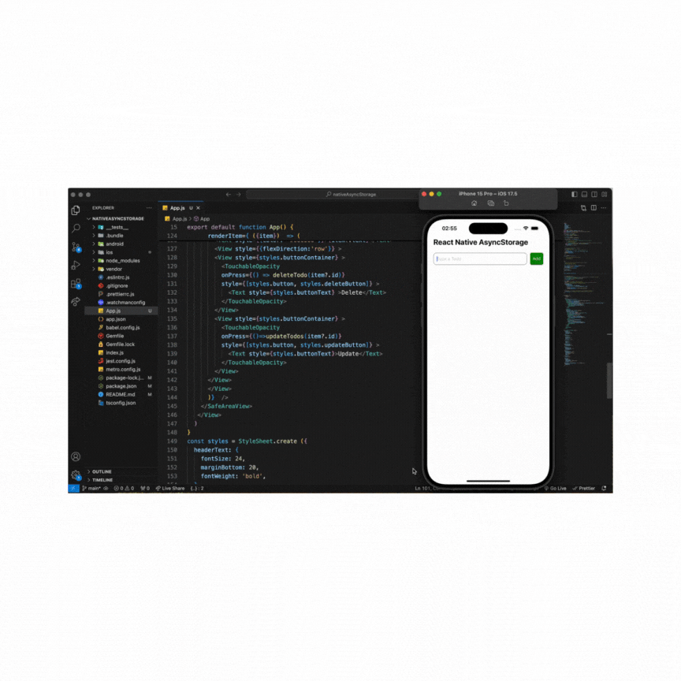

## Asyncstorage Kurulum

# npm için:

npm install @react-native-async-storage/async-storage

# yarn için:

yarn add @react-native-async-storage/async-storage

- "pod":"npx pod-install" scripte ekleriz ve npm pod veya yarn pod diyerek çalıştırırız.

## AsyncStorage

-React native uygulamalarında kalıcı veri depolamak için basit,asenkron,anahtar-değer yapısında bir depolama sistemidir.

### Kullanım Alanları:

- Kullanıcı tercihleri,temalar, dil ayarları gibi verilerin depolanması
- e-ticaret uygulamalarında kullanıcı sepetindeki ürünlerin yerel olarak saklanması
- Çevrimdışı modda kullanılacak verilerin depolanması
- Kullanıcının oturum bilgilerinin saklanması

